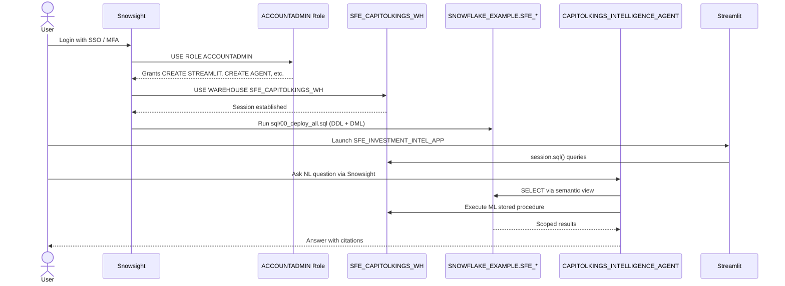

# Auth Flow - Capitol Kings Intelligence Demo
Author: Michael Whitaker  
Last Updated: 2025-11-19  
Status: Reference Impl

Reference Impl: This code demonstrates prod-grade architectural patterns and best practice. review and customize security, networking, logic for your organization's specific requirements before deployment.

## Overview
Authentication and authorization sequence for operators using Snowsight, Streamlit, and the Cortex agent.

## Component Descriptions
- **ACCOUNTADMIN Role**: Grants ability to create SFE_* schemas, warehouse, Streamlit objects, Cortex agent.
- **SFE_CAPITOLKINGS_WH**: Warehouse used for both deployment and runtime (Streamlit & agent queries).
- **SNOWFLAKE_EXAMPLE.SFE_* Schemas**: Hold all objects; RBAC enforced via the active role.
- **CAPITOLKINGS_INTELLIGENCE_AGENT**: Requires USAGE on semantic view, search service, and custom stored procedure.

## Change History
See `.cursor/DIAGRAM_CHANGELOG.md` for vhistory.
