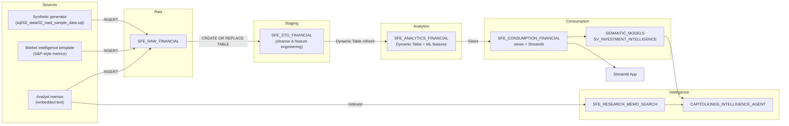

# Data Flow - Capitol Kings Intelligence Demo

Author: SE Community  
Last Updated: 2025-11-21  
Expires: 2025-12-21 (30 days from creation)  
Status: Reference Implementation

**Reference Implementation:** This code demonstrates production-grade architectural patterns and best practices. Review and customize security, networking, and logic for your organization's specific requirements before deployment.

## Overview
Illustrates how synthetic portfolio data, market benchmarks, and analyst memos move through Capitol Kings from ingestion to consumption.

## Component Descriptions
- **Sources**: Synthetic SQL generators mimic S&P Global feeds, memo text, and portfolio seeds created in `sql/02_data/02_load_sample_data.sql`.
- **SFE_RAW_FINANCIAL**: Landing layer capturing inserts before any cleansing.
- **SFE_STG_FINANCIAL**: Cleansed and feature-engineered tables built via `sql/03_transformations/01_transform_raw_to_stg.sql`.
- **SFE_ANALYTICS_FINANCIAL**: Dynamic table `SFE_DT_PORTFOLIO_METRICS` refreshed manually for on-demand accuracy.
- **Consumption**: Reporting views and Streamlit app defined in `sql/03_transformations/03_create_views.sql` and `sql/05_streamlit/01_create_streamlit.sql`.
- **Intelligence Layer**: Cortex Search service plus `CAPITOLKINGS_INTELLIGENCE_AGENT` orchestrating semantic SQL and the ML custom tool.

## Change History
See `.cursor/DIAGRAM_CHANGELOG.md` for vhistory.
