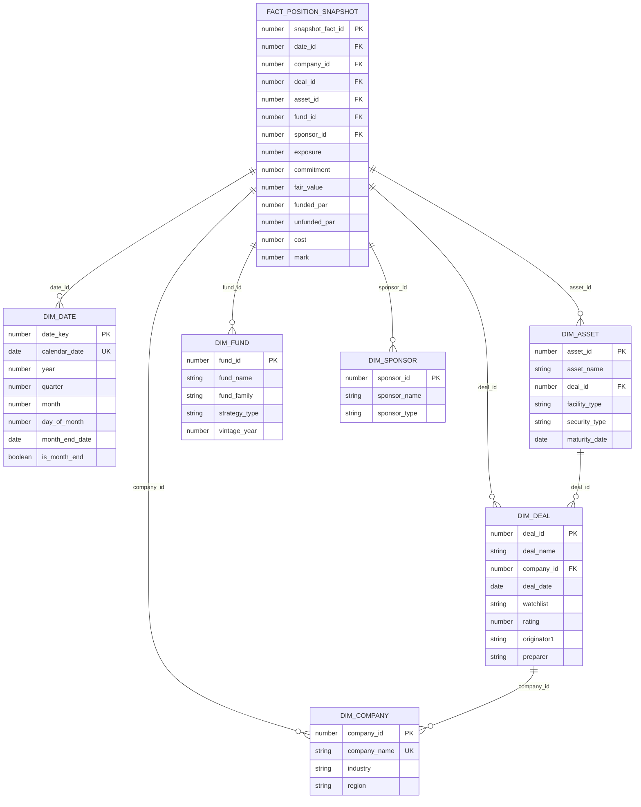

# Data Model - Capitol Kings Credit Portfolio Demo

Author: SE Community  
Last Updated: 2025-11-21  
Expires: 2025-12-21 (30 days from creation)  
Status: Reference Implementation


**Reference Implementation:** This code demonstrates production-grade architectural patterns and best practices. Review and customize security, networking, and logic for your organization's specific requirements before deployment.

## Overview

Star schema dimensional model for credit portfolio analytics. The fact table (FACT_POSITION_SNAPSHOT) sits at the center with six surrounding dimension tables providing context for deals, companies, assets, funds, sponsors, and dates. This design enables efficient analytical queries and supports natural language querying through Cortex Analyst.



## Component Descriptions

### Fact Table

**FACT_POSITION_SNAPSHOT**
- Purpose: Daily portfolio position snapshots with financial metrics
- Technology: Standard Snowflake table with numeric measures
- Location: `sql/02_data/01_create_tables.sql`
- Rows: ~10,000+ snapshots (100 assets × multiple dates)
- Grain: One row per asset per date
- Key Measures: exposure, commitment, fair_value, funded_par, unfunded_par, mark
- Deps: All six dimension tables via foreign keys

### Dimension Tables

**DIM_DATE**
- Purpose: Date spine with month-end flags for time-based analysis
- Technology: Generated date dimension (2024-2025)
- Location: `sql/02_data/01_create_tables.sql`, populated in `02_load_sample_data.sql`
- Rows: 731 days (2 years)
- Key Fields: `calendar_date`, `is_month_end`, `month_end_date`
- Special: Includes March 31, 2024 for commitment change queries
- Deps: None

**DIM_COMPANY**
- Purpose: Portfolio companies receiving credit facilities
- Technology: Reference data table
- Location: `sql/02_data/01_create_tables.sql`, populated in `02_load_sample_data.sql`
- Rows: 20 companies
- Key Fields: `company_name`, `industry`, `region`
- Special Entities: **HealthTech Solutions** (healthcare tech), **ACME Healthcare Partners**
- Deps: None

**DIM_DEAL**
- Purpose: Credit deal transactions with ratings and watchlist status
- Technology: Reference data table with relationship to DIM_COMPANY
- Location: `sql/02_data/01_create_tables.sql`, populated in `02_load_sample_data.sql`
- Rows: 50 deals
- Key Fields: `deal_name`, `watchlist`, `rating`, `originator1`
- Special Entities: Multiple originators including John Williams (8 deals, 3 on watchlist)
- Deps: DIM_COMPANY (company_id FK)

**DIM_ASSET**
- Purpose: Individual assets (facilities) within deals
- Technology: Reference data table with relationship to DIM_DEAL
- Location: `sql/02_data/01_create_tables.sql`, populated in `02_load_sample_data.sql`
- Rows: ~120 assets
- Key Fields: `asset_name`, `facility_type`, `security_type`
- Facility Types: Term Loan, Revolver, Second Lien, Delayed Draw
- Security Types: First Lien, Second Lien, Unitranche, Unsecured
- Deps: DIM_DEAL (deal_id FK)

**DIM_FUND**
- Purpose: Investment funds holding portfolio positions
- Technology: Reference data table
- Location: `sql/02_data/01_create_tables.sql`, populated in `02_load_sample_data.sql`
- Rows: 10 funds
- Key Fields: `fund_name`, `fund_family`, `strategy_type`
- Special Entities: **ACME** fund family (3 funds)
- Strategy Types: Direct Lending, Opportunistic, Core+, Mezzanine
- Deps: None

**DIM_SPONSOR**
- Purpose: Private equity sponsors backing portfolio companies
- Technology: Reference data table
- Location: `sql/02_data/01_create_tables.sql`, populated in `02_load_sample_data.sql`
- Rows: 30 sponsors
- Key Fields: `sponsor_name`, `sponsor_type`
- Sponsor Types: Mega-cap, Large-cap, Mid-market, Small-cap
- Deps: None

## Data Flow

1. **Dimension Population**: Dimensions are populated first with reference data including required entities (HealthTech Solutions, ACME, multiple originators)
2. **Fact Population**: Fact table is populated with cross-product of dimensions for snapshot dates (month-ends, March 31, current date)
3. **Semantic View**: SV_CREDIT_PORTFOLIO_OVERVIEW maps star schema to business language for Cortex Analyst
4. **Agent Queries**: CREDIT_PORTFOLIO_ANALYST executes natural language queries against semantic view
5. **Dashboard**: Streamlit app queries star schema directly for visualizations

## Query Patterns

### Example: HealthTech Solutions Financial Metrics
```sql
SELECT 
    d.calendar_date,
    c.company_name,
    SUM(f.exposure) AS total_exposure,
    SUM(f.commitment) AS total_commitment
FROM FACT_POSITION_SNAPSHOT f
JOIN DIM_COMPANY c ON f.company_id = c.company_id
JOIN DIM_DATE d ON f.date_id = d.date_key
WHERE c.company_name = 'HealthTech Solutions'
  AND d.is_month_end = TRUE
GROUP BY d.calendar_date, c.company_name;
```

### Example: Originator Watchlist Deals
```sql
SELECT 
    deals.deal_name,
    deals.watchlist,
    deals.originator1,
    companies.company_name
FROM DIM_DEAL deals
JOIN DIM_COMPANY companies ON deals.company_id = companies.company_id
WHERE deals.originator1 = 'John Williams'
  AND deals.watchlist IN ('Watchlist', 'Intensive Care');
```

### Example: Monthly Exposure Trends
```sql
SELECT 
    d.month_end_date,
    SUM(f.exposure) AS total_exposure
FROM FACT_POSITION_SNAPSHOT f
JOIN DIM_DATE d ON f.date_id = d.date_key
WHERE d.is_month_end = TRUE
  AND d.year = 2024
GROUP BY d.month_end_date
ORDER BY d.month_end_date;
```

## Design Rationale

**Why Star Schema?**
- **Query Performance**: Joins limited to fact-to-dimension, no complex chains
- **Business Clarity**: Dimensions represent business entities users understand
- **Semantic Mapping**: Natural alignment with Cortex Analyst semantic view
- **Aggregation Efficiency**: Pre-joined structure optimizes common analytical queries

**Why This Grain?**
- Asset-level facts enable drill-down from deal → asset granularity
- Daily snapshots support time-series trend analysis
- Month-end flags support period-over-period comparisons

**Key Design Decisions**:
1. Separate DEAL and ASSET dimensions (deal can have multiple assets)
2. Date dimension with month-end flags (enables monthly aggregations)
3. Watchlist and rating in DEAL dimension (these are deal-level attributes)
4. Fund family in FUND dimension (supports ACME queries)
5. Originator in DEAL dimension (supports originator-specific queries)

## Change History

See `.cursor/DIAGRAM_CHANGELOG.md` for version history.
