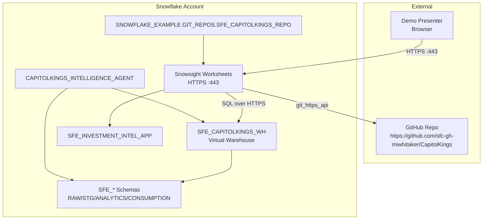

# Network Flow - Capitol Kings Intelligence Demo

Author: SE Community  
Last Updated: 2025-11-21  
Expires: 2025-12-21 (30 days from creation)  
Status: Reference Implementation

**Reference Implementation:** This code demonstrates production-grade architectural patterns and best practices. Review and customize security, networking, and logic for your organization's specific requirements before deployment.

## Overview
Connectivity diagram showing how Snowsight users, GitHub, and Snowflake services interact for the Capitol Kings demo.

## Component Descriptions
- **User / Browser**: Analyst or SE running the demo via Snowsight over TLS.
- **GitHub**: Public repo fetched through `SFE_CAPITOLKINGS_GIT_API_INTEGRATION` using `git_https_api`.
- **SFE_CAPITOLKINGS_WH**: Executes SQL, dynamic tables, semantic view queries, and Streamlit session compute.
- **SFE_* Schemas**: Store RAW/STG/ANALYTICS/CONSUMPTION objects plus stored procedures.
- **Streamlit App**: Runs entirely within Snowflake; relies on the same warehouse for queries.
- **Cortex Agent**: Routes across the semantic view, search service, and ML stored procedure while staying inside account boundaries.

## Change History
See `.cursor/DIAGRAM_CHANGELOG.md` for vhistory.
