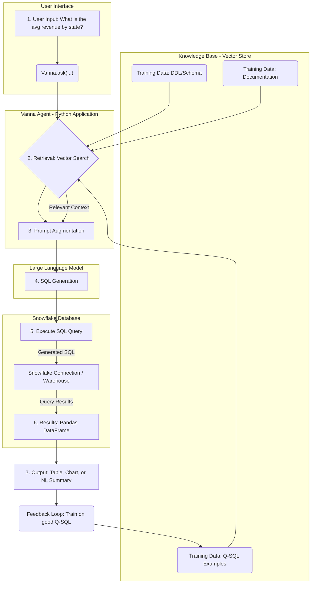

# Vanna.ai Retrieval-Augmented Generation (RAG) Architecture for Snowflake

This diagram illustrates the flow of data and logic within Vanna.ai, demonstrating how Natural Language Queries are converted into executable SQL queries specifically against a Snowflake database.

## Architecture Diagram (Mermaid Flowchart)



## Reference Example: Connecting to Snowflake

Vanna is implemented as a Python package. The core steps involve connecting, training, and querying.

### Python Usage Flow

The following steps outline how a user would interact with the Vanna library in Python to connect to a Snowflake database and execute a query:

#### Installation and Setup

```bash
# Install the core Vanna package and the Snowflake dependencies
pip install vanna vanna-snowflake
```

#### Connecting the Agent (Example Code Snippet)

```python
import vanna as vn
from vanna.snowflake import Snowflake

# 1. Initialize Vanna with your LLM and Vector Store (using the Vanna defaults/hosted solution)
class MyVanna(Snowflake, vn.OpenAI_Chat):
    def __init__(self, config=None):
        Snowflake.__init__(self, config=config)
        vn.OpenAI_Chat.__init__(self, config=config)

# Replace with your actual Snowflake connection details
snowflake_config = {
    'account': 'YOUR_ACCOUNT_IDENTIFIER',
    'username': 'YOUR_SNOWFLAKE_USER',
    'password': 'YOUR_PASSWORD',
    'database': 'YOUR_DATABASE',
    'schema': 'YOUR_SCHEMA',
    'warehouse': 'YOUR_WAREHOUSE'
}

# Initialize the agent
vn_app = MyVanna(config=snowflake_config)
```

#### Training the Model

You must provide Vanna with context. This is what makes Vanna accurate on your specific database.

```python
# Train on your database schema (DDL)
vn_app.train(ddl="CREATE TABLE CUSTOMERS (customer_id INT, state VARCHAR, revenue FLOAT);")

# Train on documentation for better context
vn_app.train(documentation="The 'revenue' column is recorded in USD and updated weekly.")

# Train on known good Q-SQL pairs
vn_app.train(
    question="What is the average revenue per state?",
    sql="SELECT state, AVG(revenue) FROM CUSTOMERS GROUP BY state;"
)
```

#### Asking a Question (The NL2SQL Execution)

```python
# Ask the question in plain English
nl_question = "Which state has the highest average customer revenue?"

# Vanna retrieves context and generates the SQL
generated_sql = vn_app.ask(nl_question)

print("Generated SQL:")
print(generated_sql)

# Execute the generated SQL on Snowflake and get the result
result_df = vn_app.run_sql(generated_sql)

print("\nQuery Results:")
print(result_df)
```

The final output is the correct SQL query and the results fetched directly from your Snowflake environment, all triggered by a simple natural language question.
